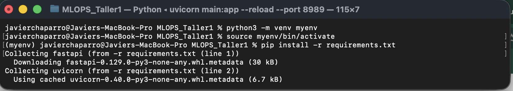
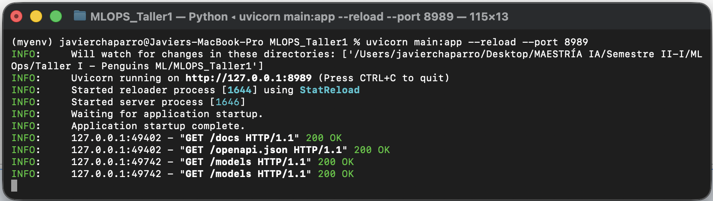
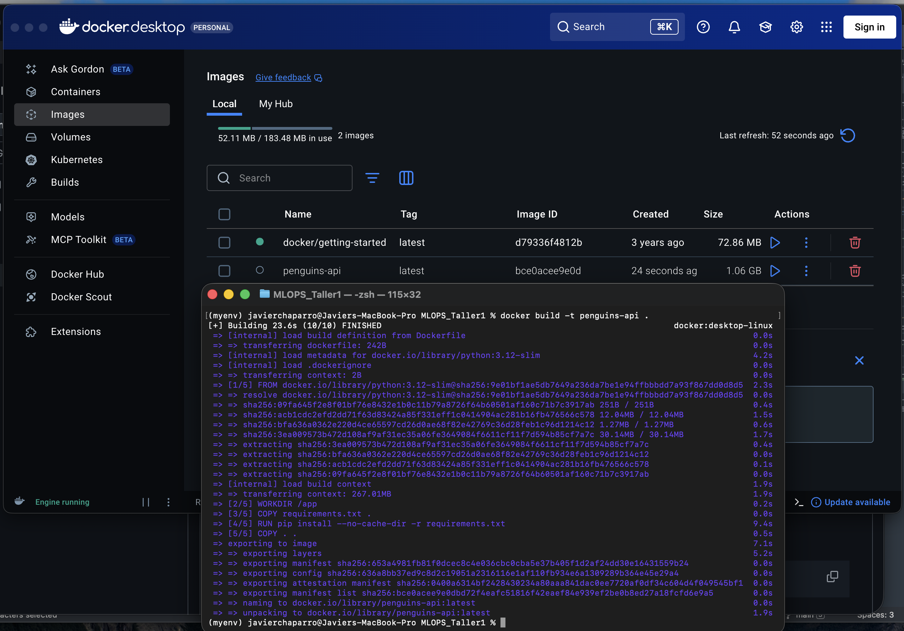
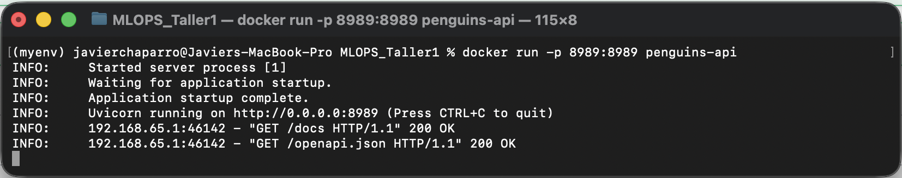
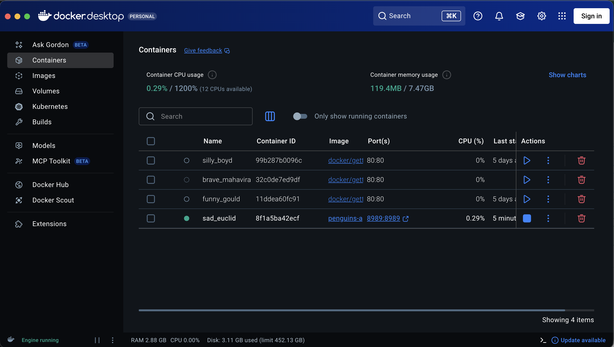
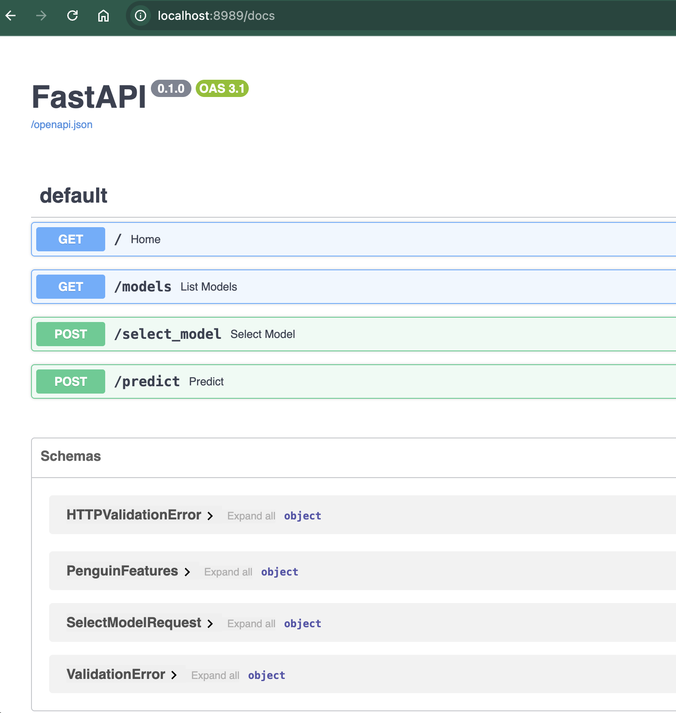
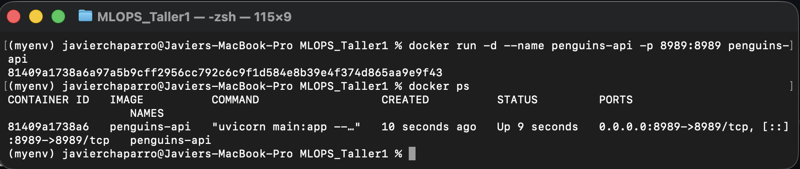
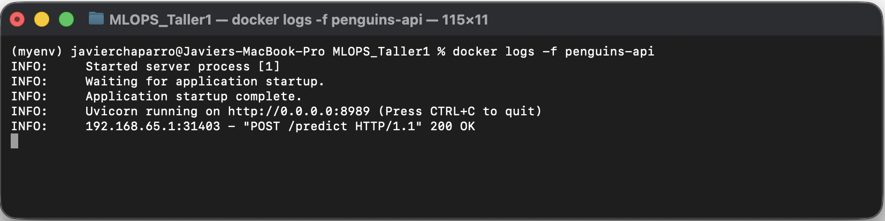
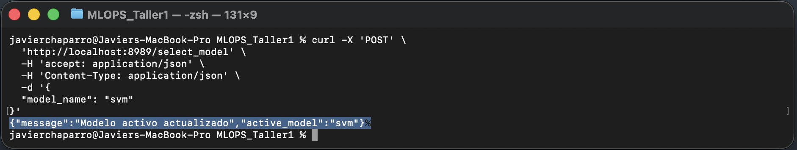
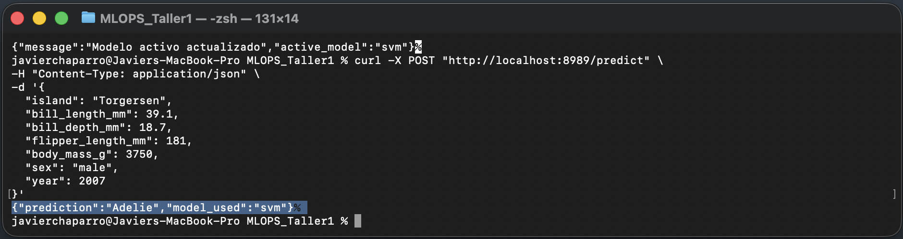

# Penguins Species Classification API – MLOps Taller 1

# Presentado Por
- Jacobo Orozco Ardila
- Javier Chaparro

## Descripción

Este proyecto implementa un flujo completo de Machine Learning utilizando el dataset Palmer Penguins.  
Se desarrolla el entrenamiento de múltiples modelos y posteriormente se expone un servicio de inferencia mediante FastAPI, el cual es contenerizado usando Docker.

El objetivo principal es aplicar buenas prácticas de MLOps separando el proceso de entrenamiento del proceso de despliegue.

---

## Estructura del Proyecto

```
MLOPS_Taller1/
│
├── entrenamiento_pinguinos.ipynb   # Entrenamiento y guardado de modelos
├── main.py                         # API FastAPI
├── Dockerfile                      # Configuración de la imagen Docker
├── requirements.txt                # Dependencias del proyecto
├── README.md
│
└── models/
    ├── logreg.joblib
    ├── rf.joblib
    ├── svm.joblib
    ├── gb.joblib
    └── registry.json
```

---

## Dataset

Se utiliza la librería `palmerpenguins` para descargar los datos.

El problema consiste en predecir la especie del pingüino:

- Adelie
- Gentoo
- Chinstrap

---

## Proceso de Entrenamiento

El entrenamiento se realiza en el notebook `entrenamiento_pinguinos.ipynb`.

Etapas principales:

1. Carga de datos
2. Separación en variables X y Y
3. División en entrenamiento y validación
4. Definición de pipelines:
   - Imputación para variables numéricas
   - Imputación + OneHotEncoding para variables categóricas
5. Entrenamiento de múltiples modelos
6. Evaluación básica con accuracy
7. Serialización de modelos usando `joblib`
8. Creación de `registry.json` con:
   - Modelo por defecto
   - Modelos disponibles

---

## API – FastAPI

La API permite:

- Consultar el estado del servicio
- Listar modelos disponibles
- Seleccionar el modelo activo
- Realizar predicciones

### Endpoints disponibles

GET `/`  
Retorna estado del servicio y modelo activo.

GET `/models`  
Lista modelos disponibles y modelo activo.

POST `/select_model`  
Permite cambiar el modelo activo.

POST `/predict`  
Recibe las características de un pingüino y retorna la predicción.

---

## Cómo ejecutar localmente (sin Docker)

1. Crear entorno virtual o usar conda.
2. Instalar dependencias:

```bash
pip install -r requirements.txt
```


3. Ejecutar la API:

```bash
uvicorn main:app --reload --port 8989
```


4. Abrir en navegador:

```
http://127.0.0.1:8989/docs
```


---

## Ejecución con Docker

### 1. Construir la imagen

Desde la raíz del proyecto:

```bash
docker build -t penguins-api .
```


### 2. Ejecutar el contenedor

```bash
docker run -p 8989:8989 penguins-api
```




### 3. Acceder a la API

```
http://localhost:8989/docs
```



---

## Tecnologías utilizadas

- Python 3.12
- Scikit-Learn
- FastAPI
- Uvicorn
- Docker
- Joblib
- Pandas

---


---

## Docker – Detalles de Contenerización

Durante este taller se agregó contenerización completa de la API para garantizar reproducibilidad y portabilidad del servicio.

### Configuración del Dockerfile

- Imagen base: `python:3.12-slim`
- Instalación de dependencias desde `requirements.txt`
- Exposición del puerto `8989`
- Ejecución del servidor con:

```bash
uvicorn main:app --host 0.0.0.0 --port 8989
```

El uso de `0.0.0.0` permite que la aplicación sea accesible fuera del contenedor.

---

### Construcción de la imagen

```bash
docker build -t penguins-api .
```

---

### Ejecución del contenedor

```bash
docker run --name penguins-api -p 8989:8989 penguins-api
```

El mapeo `-p 8989:8989` conecta:

- Puerto 8989 del host
- Puerto 8989 dentro del contenedor

Acceso a la documentación interactiva:

```
http://localhost:8989/docs
```

---

### Ejecución en background (opcional)

```bash
docker run -d --name penguins-api -p 8989:8989 penguins-api
```

---

### Verificación del contenedor

```bash
docker ps
```



---

### Ver logs del servicio

```bash
docker logs -f penguins-api
```



---

### Prueba de predicción desde consola usando modelo por defecto RF

```bash
curl -X POST "http://localhost:8989/predict" \
-H "Content-Type: application/json" \
-d '{
  "island": "Torgersen",
  "bill_length_mm": 39.1,
  "bill_depth_mm": 18.7,
  "flipper_length_mm": 181,
  "body_mass_g": 3750,
  "sex": "male",
  "year": 2007
}'
```


---

### BONO

---

### Prueba de obtención de lista de modelos disponibles


---

### Prueba de selección del modelo SVM



---

### Prueba de predicción usando modelo SVM



---

La contenerización permite ejecutar la API en cualquier entorno sin depender de la configuración local del sistema.


## Notas

- El entrenamiento y el despliegue están desacoplados.
- Los modelos se cargan dinámicamente desde el folder `models`.
- El modelo activo puede cambiarse sin reconstruir la imagen Docker.
- El preprocesamiento está integrado dentro del Pipeline, evitando data leakage.


